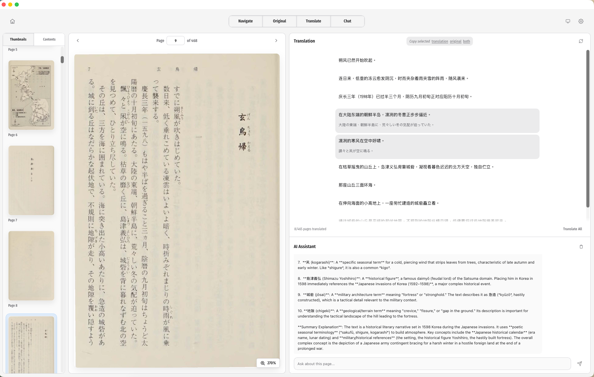

# readani

[English](./README.md) | 简体中文

<p align="center">
  
</p>

<p align="center">
  一个面向 PDF 和 EPUB 的桌面双语阅读器，让你在同一个窗口里边看原文边看译文，也能按句子对照理解。
</p>

<p align="center">
  <strong>v1.2.0</strong> · Tauri · React · TypeScript · pdf.js
</p>

## 它是什么

`readani` 把原文放在左边，把译文放在右边，让你阅读外文 PDF 或 EPUB 时，不必来回复制文本到别的翻译工具。

它不是把整页内容粗略地塞成一大段译文，而是按句子来展示，这样更容易一边阅读一边核对含义、人名、术语和上下文。

它特别适合论文、随笔、手册、报告这类需要句子级上下文的文档。

## 主要特点

- 左右分栏阅读，原文和译文并排显示
- 以 PDF 阅读为核心，同时保留 EPUB 支持
- 按句子展示翻译结果，便于更准确地对照原文
- 可以在原文页上直接选中文本做快速翻译查询
- 本地缓存翻译结果，重复打开更快
- 桌面 UI 固定为英文，支持 `system / light / dark` 主题
- 翻译请求通过 Tauri / Rust 后端发出，不会从前端直接调用模型服务
- 内置 `OpenRouter`、`DeepSeek` 和通用 `OpenAI-Compatible` 三类提供商预设

## 快速开始

### 1. 获取应用

- 从 [GitHub Releases](https://github.com/galza-guo/readani/releases) 页面下载安装包
- 在电脑上打开应用

### 2. 打开文档

- 启动 `readani`
- 打开 PDF 或 EPUB
- 左边看原文，右边看翻译面板

### 3. 添加翻译预设

- 打开 `Settings`
- 添加一个 preset
- 选择 provider
- 粘贴 API key
- 点击 `Load models`，或手动输入模型名
- 点击 `Save`
- 再点 `Test`

## Provider 配置指南

### 方案 A：OpenRouter 快速配置

如果你的网络可以顺畅访问 OpenRouter，这是最通用、最容易切换模型的方案。

1. 前往 [OpenRouter](https://openrouter.ai/) 注册账号。
2. 在 OpenRouter 控制台创建 API key。
3. 在 `readani` 里新建一个 preset，填写：
   - Provider: `OpenRouter`
   - API key: 你的 OpenRouter key
   - Model: 先填 `openrouter/free` 做免费测试，或者换成 OpenRouter 当前支持的其他模型
4. 保存后点击 `Test`。

补充说明：

- OpenRouter 还有很多带 `:free` 后缀的免费模型可用。
- 但 OpenRouter 官方也说明了，新用户只有很小的免费额度，而且免费模型的速率限制比较低，更适合试用，不适合作为长期默认公共服务。

### 方案 B：DeepSeek 快速配置

对中国大陆用户来说，这通常是最省事的替代方案，因为 `readani` 已经内置了 DeepSeek preset。

1. 前往 [DeepSeek API 平台](https://platform.deepseek.com/) 注册并创建 API key。
2. 在 `readani` 里新建一个 preset，填写：
   - Provider: `DeepSeek`
   - API key: 你的 DeepSeek key
   - Model: `deepseek-chat`
3. 保存后点击 `Test`。

DeepSeek 的 base URL 已经内置在应用里：`https://api.deepseek.com`

### 方案 C：使用更容易在中国大陆接入的 OpenAI-Compatible 服务

如果 OpenRouter 用起来不方便，可以选择 `OpenAI-Compatible`，接入支持 OpenAI Chat Completions 兼容接口的服务。

常见选择：

- [阿里云百炼 / DashScope](https://help.aliyun.com/zh/model-studio/get-api-key)
  - 中国大陆（北京）OpenAI 兼容地址：`https://dashscope.aliyuncs.com/compatible-mode/v1`
- [SiliconFlow](https://docs.siliconflow.cn/cn/api-reference)
  - Base URL：`https://api.siliconflow.cn/v1`

在 `readani` 中这样填写：

- Provider: `OpenAI-Compatible`
- Base URL: 对应服务的地址
- API key: 对应服务的 key
- Model: 点击 `Load models`，从模型列表里选一个文本 / 对话模型

### Provider 官方文档

如果用户想看 provider 自己的完整说明，可以直接看这些链接：

- OpenRouter: [API keys](https://openrouter.ai/docs/api-keys), [FAQ](https://openrouter.ai/docs/faq)
- DeepSeek: [DeepSeek API docs](https://api-docs.deepseek.com/)
- 阿里云百炼 / DashScope: [获取 API key](https://help.aliyun.com/zh/model-studio/get-api-key), [OpenAI 兼容地址与地域说明](https://help.aliyun.com/zh/model-studio/regions/)
- SiliconFlow: [API 文档](https://docs.siliconflow.cn/cn/api-reference), [速率限制](https://docs.siliconflow.cn/en/userguide/rate-limits/rate-limit-and-upgradation)

## 我该选哪个 Provider？

- 想要最方便地切换模型，并且能访问 OpenRouter：选 `OpenRouter`
- 想尽量少折腾，配置最快：选 `DeepSeek`
- 想接入国内更容易注册和使用的平台：选 `OpenAI-Compatible`，然后填 DashScope 或 SiliconFlow

## 关于免费模型和“默认公共 API”

`readani` 不会内置公共 API key，也不会默认接一个共享翻译服务。

这是有意为之，因为共享公共 key 往往会带来这些问题：

- 很容易被滥用
- 速率限制不可控
- 服务可能随时失效
- 用户无法掌控隐私、计费和可用性

现阶段更现实的“开箱先试试”方案是：

- `OpenRouter` + `openrouter/free`
- 或者使用某个 provider 当下提供的试用额度 / 赠送额度

如果你需要稳定长期使用，最好还是准备自己的 API key。

## 工作原理

### 阅读器布局

- 左边：原始 PDF 或 EPUB
- 右边：翻译、阅读控制和工具

### 翻译流程

- 前端不会直接调用模型服务
- 翻译请求统一走 Tauri 后端
- 设置和翻译缓存保存在 app config 目录下
- 只要文档、原文、provider、model 和目标语言匹配，就可以复用缓存

### PDF 支持

- 使用 `pdfjs-dist/legacy/build/pdf.mjs`
- 当 PDF 自带可用文本层时，会保留可选择文本
- 最适合文本型 PDF 和带 OCR 文本层的 PDF
- 如果是纯图片 PDF 且没有可用文本层，应用会显示 fallback，而不会假装能提取文字

## 本地开发

### 常用命令

如果你只是普通读者，不需要看这一节。下面这些命令只适用于从源码运行应用的开发者。

```bash
bun install
bun run tauri dev
```

```bash
bun run build
```

## 项目结构

- `src/App.tsx` - 主应用状态、首页与阅读器切换、共享弹窗
- `src/views/HomeView.tsx` - 首页与最近文档入口
- `src/components/PdfViewer.tsx` - PDF 阅读容器
- `src/components/PdfPage.tsx` - PDF 页面渲染与选区层
- `src/components/TranslationPane.tsx` - 翻译展示区
- `src/components/settings/SettingsDialogContent.tsx` - provider 和翻译设置界面
- `src/lib/textExtraction.ts` - PDF 文本提取逻辑
- `src/lib/pageTranslationScheduler.ts` - 翻译队列调度
- `src-tauri/src/lib.rs` - Tauri 命令与翻译流程编排
- `src-tauri/src/providers.rs` - provider 请求封装
- `src-tauri/src/page_cache.rs` - 翻译缓存处理

## 产品说明

- UI 文案固定为英文，不做多语言界面切换
- 翻译质量取决于 provider、模型和源文档质量
- 缓存命中依赖文档、原文、provider、model 和目标语言
- API key 保存在应用配置目录，不会打进前端 bundle

## 技术栈

- Tauri
- Rust
- React 19
- TypeScript
- Radix UI
- pdf.js
- Slate
- react-virtuoso

## 致谢

- Created by Gallant GUO
- Contact: [glt@gallantguo.com](mailto:glt@gallantguo.com)
- Special thanks to [Everett (everettjf)](https://github.com/everettjf), author of [PDFRead](https://github.com/everettjf/PDFRead)

## 许可证说明

仓库中包含字体资源，它们的许可证文本位于 [`src/assets/fonts/fira-sans-condensed/OFL.txt`](./src/assets/fonts/fira-sans-condensed/OFL.txt)。
